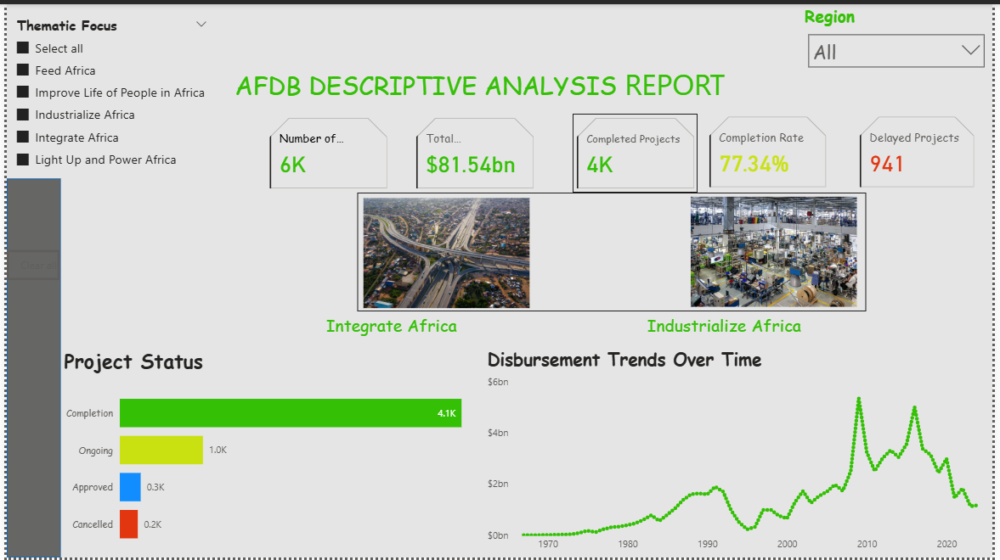

# 📊 Abiola Lawal – Data Analytics & Data Science Portfolio  

Welcome to my portfolio! 🚀  
I’m a **Data Analyst, Aspiring Data Scientist, and Trainer** who loves exploring, analyzing, and visualizing data to tell compelling stories.  
This repository highlights my projects across **finance, health, development, and aviation**, showcasing how I use **SQL, Power BI, Excel, and Python** to uncover insights and support **data-driven decision-making**.  

---

## 👨‍💻 About Me  
- 📊 **Data Analyst Consultant @ Edge Line Tech Academy** – trained 300+ students in SQL, Python, Power BI, and Excel  
- 🧑‍🏫 Experienced in **corporate training** & mentoring beginners through hands-on analytics projects  
- 🌍 Delivered impactful projects in **finance, health, and development programs**  
- 🎓 Currently learning **Data Science (ALX Academy)** & **Software Engineering (PLP Academy)**  
- 💡 Passionate about **data-for-social-impact**, **business intelligence**, and **sustainable development**  

📑 [View My Resume](http://abiolalawal14.github.io/Data_Analyst_Portfolio/)  
🔗 [LinkedIn](https://www.linkedin.com/in/abiola-lawal-abdulrafiu) 

---

# 🌍 Data-Driven Insights on AfDB “High 5” Portfolio  

> Using **Excel** + **Power BI** to analyze African Development Bank (AfDB) projects.  
> Goal: Assess **funding flows, delivery performance, and delay hotspots** to support AfDB’s **High 5 priorities**.  

### 🚀 Project Highlights  
- ✅ Portfolio: ~6,000 projects with **$81.5bn disbursements**  
- ✅ **Completion rate:** 77.3% | **Delayed projects:** 941  
- ✅ **Disbursement ratio:** 49.9% → scope to accelerate delivery  
- ✅ Regional hotspots: Southern Africa (208 delays) & West Africa (206 delays)  

📊 [View Dashboard](https://app.powerbi.com/links/lw-4taahVr?ctid=940b29f2-18a4-4aad-9354-e83cbb13f27d&pbi_source=linkShare)  
  

---

# ✈️ Regional Airline Profitability Analysis  

> Using **SQL + Power BI** to analyze airline performance across regions.  
> Goal: Assess **profitability, fleet efficiency, and passenger yields** for strategic insights.  

### 🚀 Project Highlights  
- ✅ 6 global regions analyzed  
- ✅ Average **EBIT:** $703.5M | **Load Factor:** 82%  
- ✅ Passenger Yield: $0.09/km | Avg Fleet Age: 9.5 years  
- ✅ Identified **regional leaders** & airline efficiency trends  

📊 [View Dashboard](https://app.powerbi.com/links/IBJenMHFr6?ctid=940b29f2-18a4-4aad-9354-e83cbb13f27d&pbi_source=linkShare)  
  

---

# 📈 Excelerate Platform Analytics  

> Using **Looker Studio** to analyze user engagement & opportunity participation.  
> Goal: Measure **growth, skills gained, and outcomes** across 27K+ users.  

### 🚀 Project Highlights  
- ✅ **27.6K+ sign-ups** from 102 countries  
- ✅ **20.3K+ opportunities applied** (internships, events, courses)  
- ✅ **$2.7M+ rewards/scholarships awarded**  
- ✅ Most common skills: *Critical Thinking, Collaboration, Communication*  

📊 [View Dashboard](https://lookerstudio.google.com/s/rjS5WYGl79k)  
  

---

# 💧 Water Access Equity in *Maji Ndogo*  

> Using **SQL + Power BI** to assess water projects across rural & urban towns.  
> Goal: Track **completion, costs, and vendor performance** to ensure equitable access.  

### 🚀 Project Highlights  
- ✅ **18.3M+ people reached** | **5 provinces analyzed**  
- ✅ **Budget vs Spend:** ₦146.7M vs ₦154.4M → **5.29% overrun**  
- ✅ Rural projects cost **84% more** than urban projects  
- ✅ Vendor benchmarking showed efficiency gaps  

📊 [View Dashboard](https://app.powerbi.com/view?r=eyJrIjoiMzA2NDlkOTItZWQyYi00YmQwLWIyZTAtOTZjOTFjY2Y1OTdkIiwidCI6ImRmODY3OWNkLWE4MGUtNDVkOC05OWFjLWM4M2VkN2ZmOTVhMCJ9)  
  

---

## 🛠 Tools & Tech Stack  
  
  
  
  
  

---

## ✅ Conclusion  
Through these projects, I’ve demonstrated the power of **SQL, Python, Excel, Power BI, and Looker Studio** in solving diverse real-world problems.  
From **international finance** to **community health** and **aviation**, my work highlights how **data storytelling** drives better decisions.  

✨ *Let’s make data work for us — transforming insights into real-world impact.*  
